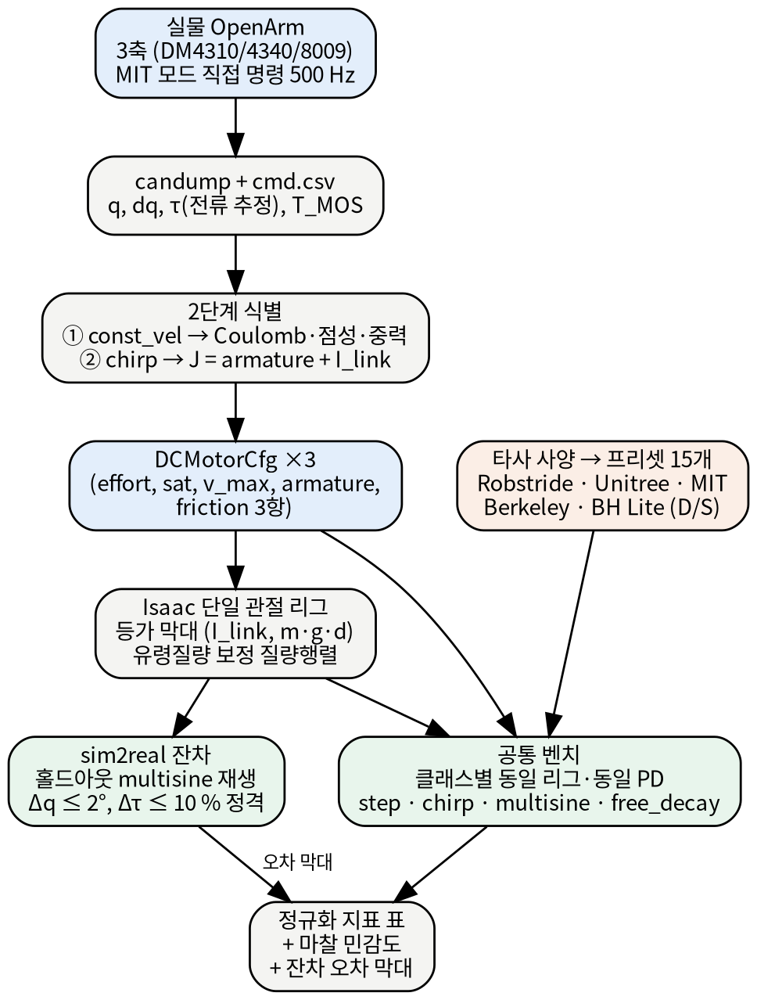
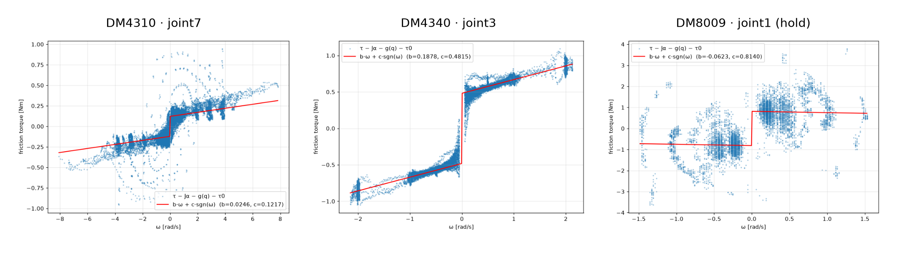
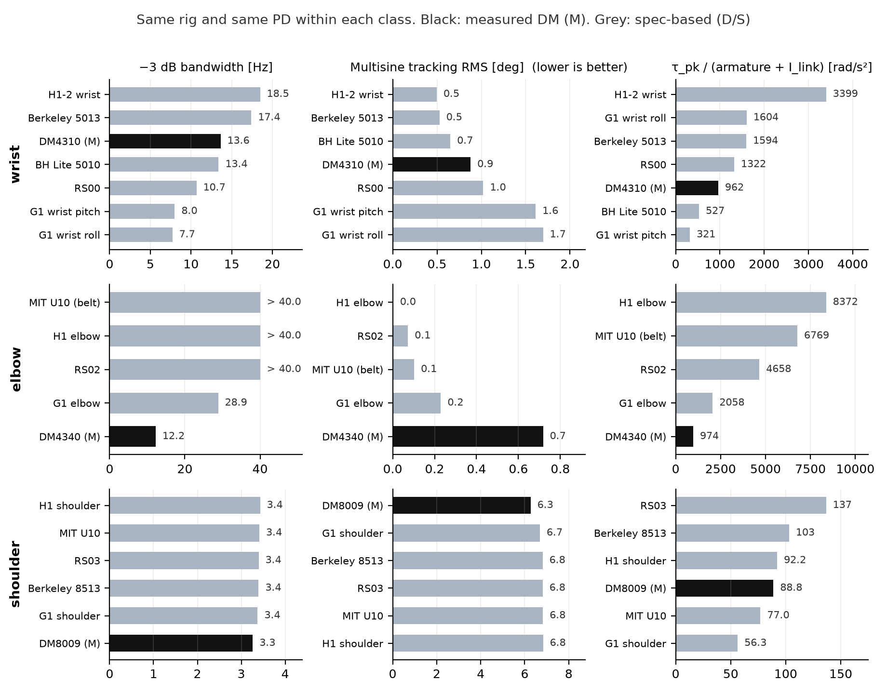
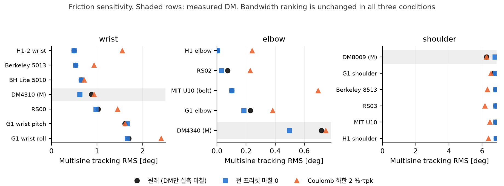

::: {.summary}
## 요약

OpenArm 실물의 Damiao 준직접구동(QDD) 모터 3종을 시스템 식별하여 Isaac Lab `DCMotorCfg` 로 옮기고, 오픈소스 휴머노이드에서 공개된 QDD 액추에이터 15개와 동일한 단일 관절 시뮬레이션 리그에서 정규화 지표로 비교하였다. 실물 측정값과 시뮬 수치를 직접 비교하지 않고 양쪽을 같은 표현(액추에이터 파라미터)으로 옮긴 뒤 비교하였으며, 실물에서 모델로 옮길 때 생기는 잔차를 따로 측정하여 오차 막대로 제시한다.

<div class="tiles">
<div class="tile"><div class="k">3 / 3</div><div class="l">sim2real 잔차 합격<br>Δq RMS 0.38 / 0.57 / 0.84° (기준 2°)</div></div>
<div class="tile"><div class="k">1.7 ~ 2.0 %</div><div class="l">Coulomb 마찰 / 피크 토크<br>세 모터가 같은 비율</div></div>
<div class="tile"><div class="k">18</div><div class="l">공통 벤치 프리셋<br>6계열 · 3 관절 클래스 · 4 프로토콜</div></div>
<div class="tile"><div class="k">7</div><div class="l">부수 발견<br>에셋 오류 2 · 모델 함정 2 · 모터 특성 3</div></div>
</div>

**결론**

1. **DM 3종의 식별이 완료되었고 3축 모두 잔차 기준을 통과하였다.** 홀드아웃 다중 사인 재생에서 위치 잔차 RMS 는 0.38° / 0.57° / 0.84° (기준 2°), 토크 잔차는 정격 대비 2~4 % (기준 10 %) 이다. DM4340 의 armature 실측값은 펌웨어 로터관성 × 감속비² 와 12 % 이내로 일치한다.
2. **같은 리그에서 비교하면 DM 의 위치는 파라미터 값이 정하는 자리에 있다.** 손목 클래스에서 DM4310 의 폐루프 대역폭 13.6 Hz 는 armature 0 인 모델(17~18 Hz)과 armature 0.01 kg·m² 인 G1(8 Hz) 사이에 있다. 팔꿈치 클래스의 DM4340(감속비 40:1) 은 12 Hz 로 동급의 절반 이하인데, armature 가 링크 관성의 12배이고 최고 속도가 5.4 rad/s 이기 때문이다. 어깨 클래스는 링크 관성이 지배하여 6개 모터의 PD 응답이 3 % 이내로 같고 마찰에서만 차이가 난다.
3. **정상오차·추종·백드라이브에서 DM 이 불리해 보이는 것은 마찰 데이터가 DM 에만 있기 때문이다.** 타사 모델 대부분은 마찰이 공개되지 않아 0 으로 들어가 있다. 전 프리셋의 마찰을 0 으로 놓으면 DM 은 타사 사이에 들어가고, 타사에 DM 과 같은 비율(피크의 2 %)의 마찰을 넣으면 DM 과 같거나 더 나빠진다. 대역폭 순위는 어느 가정에서도 바뀌지 않는다.

**부수 발견.** Isaac Lab 공식 OpenArm 에셋의 유령 질량(관성 최대 9배 과대)과 고정관절 export 오류, Isaac Sim 5 마찰 모델에서 `friction` 만 채우면 Coulomb 마찰이 0 이 되는 문제, DM4310 의 3.5 Hz 이상 백래시 영역 등 7건(§6).
:::

# 1. 목적·범위·원칙

## 1.1 배경

OpenArm 은 Damiao DM4310 ×4, DM4340 ×2, DM8009 ×2 (그리퍼 제외) 의 QDD 모터로 구성된 양팔이다. 시뮬레이션에서 학습한 정책을 실물로 옮기려면 액추에이터 모델이 실물과 맞아야 하고, 하드웨어 선정과 개선을 논의하려면 다른 오픈소스 휴머노이드의 액추에이터와 같은 기준으로 비교할 수 있어야 한다. 이 두 가지가 본 작업의 목적이다.

## 1.2 범위

| 항목 | 결정 |
|:---|:---|
| 식별 대상 | DM4310 / DM4340 / DM8009 각 대표 1축 (우팔 joint7 / joint3 / joint1). 동일 모델은 동일 파라미터로 가정 |
| 모델 클래스 | Isaac Lab `DCMotorCfg`: effort / saturation / velocity 한계, armature, 마찰 3항(static, dynamic, viscous) |
| 식별 파라미터 | Coulomb 마찰, 점성 마찰, armature(반사 관성), 중력 토크 진폭, 명령→피드백 지연 |
| 비교 대상 | 오픈소스 휴머노이드 QDD 6계열: Robstride(K-Bot), Unitree G1·H1·H1-2, MIT Humanoid, Berkeley Humanoid, Berkeley Humanoid Lite. 팔 관절 클래스(손목 / 팔꿈치 / 어깨)로 매칭한 15개 프리셋 |
| 비교 지표 | −3 dB 폐루프 대역폭, 다중 사인 추종 RMS, 스텝 정착 시간과 정상오차, 백드라이브 감쇠, τ_pk/(armature+I_link). 모두 정규화 지표이며 토크밀도는 데이터시트 값 |

## 1.3 비교 원칙

- **비대칭 비교임을 표기한다.** DM 3종만 실측(M)이고 나머지는 데이터시트(D) 또는 시뮬 cfg 값(S)이다. 모든 표에 출처 등급을 붙인다.
- **사양표에 없는 값은 0 이 아니라 미확인 값이다.** 그러나 시뮬레이터에는 0 으로 들어간다. 이 영향은 마찰 민감도 분석(§5.4)으로 정량화한다.
- **PD 게인은 모터 속성이 아니므로 클래스마다 통일한다.** OpenArm 운용 게인을 쓰고, 모터마다 다른 것은 `DCMotorCfg` 파라미터뿐이도록 한다.
- **모델의 유효 대역을 표기한다.** 잔차가 합격한 주파수 대역 밖의 결과는 예측치로 취급한다.

## 1.4 범위에서 제외한 것

토크상수(Kt) 절대 캘리브레이션(추가 없어 펌웨어 유도값 참고), 부하 상태의 속도-토크 곡선(데이터시트 사용), 열 모델(T_MOS 베이스라인만 기록), ActuatorNet, 그리퍼 모터, Isaac Lab 외부 로봇의 USD 변환. 상세는 §8.

# 2. 방법

{width=60%}

## 2.1 실물 계측

**제어 경로.** ros2_control 을 우회하고 CAN-FD(1 M / 5 M) 로 Damiao MIT 모드를 500 Hz 로 직접 명령한다(`tools/excite.py`). 명령 (q_des, dq_des, kp, kd, τ_ff) 과 피드백 (q, dq, τ, T_MOS, T_Rotor, 에러코드) 을 `candump` 커널 타임스탬프로 기록하고 파서(`candump2csv.py`)로 CSV 화한다. 피드백 τ 는 토크 센서 값이 아니라 전류 기반 추정치(Kt·Iq)이다.

**여기 궤적.** 여섯 가지 모드를 사용하였다.

| 모드 | 정의 | 용도 |
|:---|:---|:---|
| const_vel | 사다리꼴 속도 프로파일 위치 램프, 속도 레벨 0.25~3 rad/s | 마찰·중력 식별 (1단계) |
| chirp | 토크 지수 처프 0.1 → 3.5 / 8 Hz, 약한 센터링 PD + 중력 보상 피드포워드 | 관성 식별 (2단계) |
| multisine | {0.3, 0.7, 1.3, 2.9} Hz 합, 위상 고정 시드 | 홀드아웃 (피팅에 미사용) |
| step / free_decay / hold | PD 스텝, 자유 감쇠, 정지 유지 | 물리 확인, 온도 베이스라인 |

삼각파 속도 프로파일은 반전 순간의 충격이 기어 백래시에 부딪히는 것이 확인되어 사다리꼴로 교체하였다.

**안전.** 각도·속도·토크 클램프, soft-limit 근접 시 토크 축소, 에러코드와 피드백 누락 감시, 종료는 Ctrl+C 로 통일하였다. 타깃 1축만 enable 하고 나머지는 disable(백드라이브 자유) 상태로 매달린 자세에서 실행하였다. 어깨(joint1)는 하류 관절이 흔들려 잔차가 커지므로 하류 6축을 PD 로 유지하는 `--hold-others` 기능을 추가하였다(사고 기록 §9).

**데이터 품질.** 전 실험에서 피드백 수신 100 %(누락 ≤1 틱/런), 에러코드 0, 루프 지연 초과 0 이었다. 실험 중 T_MOS 상승은 1 °C 이하(대기 27~31 °C)였다.

## 2.2 2단계 시스템 식별

관절 공간의 강체 1자유도 모델을 사용한다.

> τ = J·q̈ + b·q̇ + c·sgn(q̇) + g_s·sin q + g_c·cos q + τ₀

- **1단계 (const_vel 정속 구간).** q̈ ≈ 0 인 구간만 써서 b, c, g_s, g_c, τ₀ 를 최소제곱으로 푼다. 처프 데이터에서 마찰을 함께 풀면 고주파 구간에서 마찰이 16 % 낮게 추정되는 것을 합성 데이터로 확인하여 두 단계로 분리하였다.
- **2단계 (chirp).** 1단계 결과를 고정하고 J 만 푼다. J 는 총 유효 관성이므로 armature = J − I_link 이며, I_link 은 Isaac OpenArm 모델의 관절 공간 질량행렬 대각항(유령 질량 보정 후, §6 발견 1)에서 읽는다.
- **방법 검증.** 정답을 아는 합성 모터(`synth` 프리셋)를 Isaac 에서 같은 프로토콜로 돌려 피팅한 결과 armature +3 %, Coulomb +0.3 %, 점성 −2 %, 중력 +0.2 % 의 오차였다.
- **실측하지 않은 파라미터.** velocity_limit 은 데이터시트의 무부하 최고속을 사용하였다(팔 가동 범위에서 도달 불가). 명령→피드백 지연은 candump 에서 150 µs 로 측정되어 500 Hz 기준 0 스텝이며 DelayedPD 는 쓰지 않았다.

## 2.3 단일 관절 리그와 잔차 검증

**등가 막대.** 고정 베이스 + revolute 1개 + 막대 링크로 된 최소 USD 를 생성하고, 실물 관절의 (I_link, m·g·d) 와 같아지도록 막대 질량과 길이를 결정한다 (I = (4/3)·m·d², m·g·d 지정 → d, m, L = 2d). 중력 토크가 무시 가능한 축(joint3, 롤)은 관절축을 중력과 정렬하고 관성만 맞춘다. 중력 droop 과 진자 주기가 이론값과 일치하는 것으로 리그의 물리를 확인하였다.

**잔차.** 홀드아웃 multisine 의 실물 명령 (q_des, dq_des, kp, kd, τ_ff) 을 리그에 그대로 재생하고, 실물과 시뮬의 q 와 τ 차이를 RMS 로 계산한다. 합격 기준은 Δq RMS ≤ 2°, Δτ RMS ≤ 10 % × 정격 토크로 하였다.

## 2.4 공통 벤치 프로토콜

클래스마다 리그(I_link, m·g·d)와 PD 게인을 고정하고, 18개 프리셋을 같은 스테이지에 동시에 올려 4개 프로토콜을 실행한다(`isaac/bench_all.py`, 소요 4.3 분). 리그는 §2.3 에서 잔차를 검증한 세 리그를 그대로 사용한다.

| 클래스 | 리그 (OpenArm 대표 관절) | I_link [kg·m²] | m·g·d [Nm] | kp / kd (운용값) | 프리셋 |
|:---|:---|---:|---:|:---|:---|
| wrist | joint7, 진자 | 0.00559 | 0.72 | 10 / 0.5 | DM4310, RS00, Berkeley 5013, BH Lite 5010, G1 wrist roll·pitch, H1-2 wrist |
| elbow | joint3, 롤 축(중력 정렬) | 0.00215 | ≈0 | 70 / 2.0 | DM4340, RS02, MIT U10(belt), G1 elbow, H1 elbow |
| shoulder | joint1, 진자 | 0.434 | 11.74 | 70 / 2.75 | DM8009, RS03, Berkeley 8513, MIT U10, G1 shoulder, H1 shoulder |

| 프로토콜 | 정의 | 지표 |
|:---|:---|:---|
| step | ±0.3 rad, 2 s 유지 × 2회 (7개 전이 평균) | 10–90 % 상승 시간, 오버슈트, 5 % 정착 시간, 정상오차(마지막 0.2 s), 포화 비율 |
| chirp | 위치 기준 선형 처프 0.1 rad, 0.2 → 20 Hz (팔꿈치 40, 어깨 8), 30 s | 폐루프 FRF H = q/q_des 를 처프 위상으로 락인 복조(5주기 창)하여 −3 dB 대역폭, 공진 피크 |
| multisine | {0.3, 0.7, 1.3, 2.9} Hz 합 0.4 rad, 14 s (홀드아웃과 동일 정의) | 램프 후 추종 RMS 와 최대, 토크 RMS 와 피크 |
| free_decay | 1.5 s 유지 후 kp = kd = 0. 진자 리그는 0.8 rad 에서 놓고, 중력 정렬 리그는 2 rad/s 로 돌려 보냄 | 이동 여부, 이동량, 정지 시간, 스윙 수, 정지각 |

`effort_limit` 은 전 프리셋 피크(saturation_effort)로 통일하였다. Isaac Lab DCMotor 에서 effort_limit 은 속도-토크 직선의 상한이므로 정격으로 두면 피크에 도달하지 못하며, 수 초 길이의 과도응답 벤치에는 피크가 적절하다(§6 발견 7).

# 3. 식별 결과

## 3.1 파라미터

| 모터 | 식별 축 | 감속 | Coulomb c [Nm] | 점성 b [Nm·s/rad] | armature [kg·m²] | J_fit (총 관성) | I_link (Isaac) | m·g·d [Nm] | R² (1단계) | 잔차 RMS [Nm] | 정격/피크 [Nm] (D) | v_max [rad/s] |
|:---|:---|:---|---:|---:|---:|---:|---:|---:|---:|---:|---:|---:|
| **DM4310** | joint7 (손목) | 10:1 | 0.122 ± 0.0002 | 0.0246 ± 0.0002 | 0.00169 (펌웨어†) | 0.0059 | 0.0056 | 0.72 ± 0.0002 | 0.997 | 0.022 | 3.0 / 7.0 | 20.9 (D) |
| **DM4340** | joint3 (팔꿈치 롤) | 40:1 | 0.482 ± 0.0007 | 0.188 ± 0.0007 | 0.02557 (**처프 실측**) | 0.0277 | 0.0022 | 0.037 ± 0.0008 | 0.996 | 0.040 | 9.0 / 27.0 | 5.4 (D) |
| **DM8009** | joint1 (어깨) | 9:1 | 0.814 ± 0.01 (hold)§ | 0.10 ± 0.05§ | 0.01669 (펌웨어‡) | – | 0.4341 | 11.74 ± 0.04 | 0.939 | 0.70 | 20.0 / 40.0 | 16.8 (D) |


† DM4310 (joint7): 총 유효 관성 J = 0.0059 는 홀드아웃으로 검증되지만, 그리퍼 관성의 불확실성(시뮬 중력 토크 0.54 vs 실측 0.72 Nm, +33 %)이 armature(0.0017)보다 커서 J 에서 armature 를 분리할 수 없다. 펌웨어 로터관성 1.689×10⁻⁵ × 10² 을 사용하였다.
‡ DM8009 (joint1): armature 가 링크 관성 0.434 의 4 % 라 처프로 분리되지 않는다. 펌웨어 2.06×10⁻⁴ × 9² 을 사용하였다.
§ DM8009 마찰은 하류 6축을 PD 로 유지한(hold) 조건의 값이다. 하류를 disable 한 조건에서는 0.95 Nm 이며, 차이 0.14 Nm 는 하류 관절이 흔들리며 생기는 마찰로 해석한다. 점성 마찰은 hold 조건 피팅값이 −0.06 ± 0.025 로 부호가 불안정하여 비hold 조건의 0.10 ± 0.05 를 채택하였다.

{width=100%}

## 3.2 교차검증

- **DM4340 (joint3).** 롤 축이라 하류 질량의 영향이 없고 armature 를 가장 깨끗하게 분리할 수 있다. 실측 0.0256 은 펌웨어 로터관성 × 40² = 0.0290 과 12 % 차이다. J 는 0.1~8 Hz 전 대역에서 5 % 이내로 안정적이었다(진폭 1.2 Nm 가 백래시를 충분히 넘김).
- **DM4310 (joint7).** J 가 여기 진폭에 따라 달라진다. 0.6 Nm 처프에서 0.0060, 0.3 Nm 처프에서 0.0043 으로, armature 의 계통 불확실성은 ±0.0015 이다. 3.5 Hz 이상, 출력 변위 1° 미만에서는 J 추정치가 0.003 → 0.001 로 줄어드는 백래시 영역이 나타난다(§6 발견 2). 강체 DCMotor 모델에는 저주파 J 를 사용한다.
- **DM8009 (joint1).** 11 Nm 중력 부하 아래에서 kp 70 PD 로 정속을 유지할 때의 토크 요동(잔차 0.6~0.7 Nm, 구조 없는 노이즈)이 지배적이다. 이 마찰은 부하 조건의 값이며 데이터시트의 무부하 마찰과는 다르다.

## 3.3 사용 조건과 한계

- τ 피드백이 전류 추정치이므로 Kt 오차가 마찰·중력 값에 비례 오차로 들어간다. Kt 는 펌웨어 Flux·NPP 유도값(DM4310 ≈ 0.97 Nm/A) 을 참고하였고 절대 캘리브레이션은 하지 않았다.
- DM4310 은 3.5 Hz 이상이 강체 모델의 범위 밖이다.
- DM8009 마찰은 hold 조건의 값이며, 전체 팔 자세와 하류 게인에 따라 ±0.1 Nm 정도 달라질 수 있다.

# 4. sim2real 잔차

| 모터 | 표본 (500 Hz) | Δq RMS | Δq max | Δτ RMS (정격 대비) | 기준 (Δq / Δτ) | 추종오차 실물 / 시뮬 | 유효 대역 | 판정 |
|:---|---:|---:|---:|---:|---:|---:|---:|---:|
| **DM4310** | 10000 | 0.38° | 0.92° | 0.11 Nm (4 %) | 2° / 0.3 Nm | 1.09° / 1.08° | 0.3~2.9 Hz | **PASS** |
| **DM4340** | 10000 | 0.57° | 1.25° | 0.25 Nm (3 %) | 2° / 0.9 Nm | 1.22° / 0.70° | 0.3~2.9 Hz | **PASS** |
| **DM8009** | 10000 | 0.84° | 1.66° | 0.48 Nm (2 %) | 2° / 2.0 Nm | 1.59° / 1.60° | ≤1.5 Hz | **PASS** |


- 세 축 모두 합격이며, 추종오차 자체도 실물과 시뮬이 거의 같다(DM4310 1.09° vs 1.08°, DM8009 1.59° vs 1.60°). DM4340 은 실물 1.22° vs 시뮬 0.70° 로 시뮬이 낙관적이다. Coulomb 마찰이 kp 70 에서 만드는 데드밴드 외에 백래시나 전달계의 비강체 특성이 실물에 더 있다는 뜻이며, 팔꿈치 클래스의 오차 막대로 반영한다.
- **DM8009 의 유효 대역은 1.5 Hz 이하이다.** 2.9 Hz 성분을 포함한 홀드아웃은 hold 조건에서도 Δτ 2.56 Nm 로 기준을 넘었다. 원인은 액추에이터가 아니라 팔꿈치(joint4) PD 스프링(kp 60, I 0.098, 공진 약 4 Hz)과의 다관절 커플링이며, joint4 가 74 mrad 흔들리는 것이 기록되었다. 단일 관절 리그의 범위 밖이므로 저주파 홀드아웃(≤1.3 Hz)으로 판정하고 유효 대역을 표기하였다. 전체 팔 Isaac 재생으로 확인할 수 있다(선택 과제).
- 이 잔차가 §5 의 DM 열에 붙는 오차 막대이다. 위치 지표 ±0.4~0.8°, 토크 지표 ±정격 2~4 %.

# 5. 공통 벤치 비교

## 5.1 데이터시트 수준 비교 (팔 클래스)

출처 등급은 **M** 실측(다이노, 펌웨어, 처프 피팅), **D** 데이터시트, **S** 시뮬 cfg 값(튜닝 또는 플레이스홀더 가능)이다. Unitree MJCF 의 armature 0.01 은 전 관절 공통값이고, K-Scale MJCF 값은 클래스별 튜닝 추정값이다. 질량이 공개되지 않은 항목은 토크밀도를 계산하지 않았다. 다리 클래스를 포함한 전체 표(23개, 20열)는 부록 A 에 있다.

::: {.long}
| 계열 | 액추에이터 | 클래스 | 피크 Nm | 정격 Nm | 최고속도 rad/s | 감속비 | 질량 kg | 피크밀도 Nm/kg | 정격밀도 Nm/kg | armature kg·m² | arm 출처 | τpk/armature rad/s² |
|:---|:---|:---|---:|---:|---:|---:|---:|---:|---:|---:|---:|---:|
| Unitree | G1 wrist_roll | wrist | 25 | - | 37 | - | - | - | - | 1.00e-02 | S(MJCF 공통값) | 2500 |
| Unitree | H1-2 wrist_roll | wrist | 19 | - | 31.4 | - | - | - | - | - | - | - |
| Robstride | RS00 | wrist | 14 | 5 | 33 | 10 | 0.31 | 45.2 | 16.1 | 5.00e-03 | S(K-Scale MJCF) | 2800 |
| Berkeley | 5013 | wrist | 9.7 | 4.59 | 83.7 | 9 | 0.251 | 38.6 | 18.3 | 4.94e-04 | D(rotor×G²) | 19632 |
| Damiao | DM4310 | wrist | 7 | 3 | 20.9 | 10 | 0.3 | 23.3 | 10 | 1.69e-03 | M(fw) | 4142 |
| Unitree | G1 wrist_pitch | wrist | 5 | - | 22 | - | - | - | - | 1.00e-02 | S(MJCF 공통값) | 500 |
| Berkeley Lite | 5010 | wrist | 4 | - | 10 | - | - | - | - | 2.00e-03 | S(Isaac cfg) | 2000 |
| MIT | U10@elbow | elbow | 52.2 | - | 35 | 9.33 | - | - | - | 5.56e-03 | M(dyno) | 9386 |
| Damiao | DM4340 | elbow | 27 | 9 | 5.45 | 40 | 0.375 | 72 | 24 | 2.56e-02 | M(chirp fit) | 1056 |
| Unitree | G1 elbow | elbow | 25 | - | 37 | - | - | - | - | 1.00e-02 | S(MJCF 공통값) | 2500 |
| Unitree | H1 elbow | elbow | 18 | - | 20 | - | - | - | - | - | - | - |
| Robstride | RS02 | elbow | 17 | 7 | 42.9 | 7.75 | 0.38 | 44.7 | 18.4 | 1.50e-03 | S(K-Scale MJCF) | 11333 |
| Robstride | RS03 | shoulder | 60 | 21 | 20.4 | 9 | 0.9 | 66.7 | 23.3 | 5.00e-03 | S(K-Scale MJCF) | 12000 |
| Berkeley | 8513 | shoulder | 45.3 | 18.9 | 40.7 | 9 | 0.756 | 59.9 | 25 | 5.59e-03 | D(rotor×G²) | 8105 |
| Damiao | DM8009 | shoulder | 40 | 20 | 16.8 | 9 | 0.93 | 43 | 21.5 | 1.67e-02 | M(fw) | 2397 |
| Unitree | H1 shoulder_pitch | shoulder | 40 | - | 9 | - | - | - | - | - | - | - |
| MIT | U10@shoulder_flexion | shoulder | 33.6 | - | 55 | 6 | 0.619 | 54.3 | - | 2.30e-03 | M(dyno) | 14609 |
| Unitree | G1 shoulder_pitch | shoulder | 25 | - | 37 | - | - | - | - | 1.00e-02 | S(MJCF 공통값) | 2500 |

:::

## 5.2 시뮬 벤치 지표

같은 리그, 같은 PD 이므로 행 사이의 차이는 `DCMotorCfg` 파라미터(τ_pk, v_max, armature, Coulomb, 점성)의 차이만 반영한다. Coulomb 열의 "0 (미공개)" 는 데이터가 없다는 뜻이지 마찰이 없다는 뜻이 아니다.

**손목 클래스** (joint7 리그, kp 10 / kd 0.5)

| 액추에이터 | 등급 | τpk [Nm] | v_max [rad/s] | armature [kg·m²] | Coulomb [Nm] | arm/I_link | −3 dB [Hz] | 오버슈트 [%] | 정상오차 [°] | 추종 RMS [°] | 백드라이브 정지 [s] |
|:---|:---|---:|---:|---:|---:|---:|---:|---:|---:|---:|---:|
| H1-2 wrist | D | 19 | 31.4 | 0 (미공개) | 0 (미공개) | 0.00 | 18.5 | 0 | 0.65 | 0.50 | 미정지 |
| Berkeley 5013 | D | 9.7 | 83.7 | 4.94e-04 | 0 (미공개) | 0.09 | 17.4 | 0 | 0.65 | 0.53 | 미정지 |
| **DM4310** | M | 7 | 20.9 | 1.69e-03 | 0.122 | 0.30 | 13.6 | 0 | 1.30 | 0.88 | 0.33 |
| BH Lite 5010 | S | 4 | 10.0 | 2.00e-03 | 0 (미공개) | 0.36 | 13.4 | 0 | 0.65 | 0.65 | 미정지 |
| RS00 | D+S | 14 | 33.0 | 5.00e-03 | 0.1 | 0.89 | 10.7 | 0 | 0.80 | 1.02 | 1.15 |
| G1 wrist pitch | D+S | 5 | 22.0 | 1.00e-02 | 0.1 | 1.79 | 8.0 | 2 | 0.57 | 1.61 | 1.40 |
| G1 wrist roll | D+S | 25 | 37.0 | 1.00e-02 | 0.2 | 1.79 | 7.7 | 0 | 0.64 | 1.70 | 0.48 |


**팔꿈치 클래스** (joint3 리그, 롤 축, kp 70 / kd 2.0)

| 액추에이터 | 등급 | τpk [Nm] | v_max [rad/s] | armature [kg·m²] | Coulomb [Nm] | arm/I_link | −3 dB [Hz] | 오버슈트 [%] | 정상오차 [°] | 추종 RMS [°] | 백드라이브 정지 [s] |
|:---|:---|---:|---:|---:|---:|---:|---:|---:|---:|---:|---:|
| H1 elbow | D | 18 | 20.0 | 0 (미공개) | 0 (미공개) | 0.00 | > 40 | 0 | 0.00 | 0.00 | 한계 접촉 |
| MIT U10 (belt) | M(dyno) | 52.2 | 35.0 | 5.56e-03 | 0 (미공개) | 2.59 | > 40 | 0 | 0.00 | 0.10 | 한계 접촉 |
| RS02 | D+S | 17 | 42.9 | 1.50e-03 | 0.1 | 0.70 | > 40 | 0 | 0.08 | 0.07 | 0.07 |
| G1 elbow | D+S | 25 | 37.0 | 1.00e-02 | 0.2 | 4.65 | 28.9 | 0 | 0.16 | 0.23 | 0.12 |
| **DM4340** | M | 27 | 5.4 | 2.56e-02 | 0.481 | 11.89 | 12.2 | 0 | 0.23 | 0.72 | 0.08 |


**어깨 클래스** (joint1 리그, kp 70 / kd 2.75)

| 액추에이터 | 등급 | τpk [Nm] | v_max [rad/s] | armature [kg·m²] | Coulomb [Nm] | arm/I_link | −3 dB [Hz] | 오버슈트 [%] | 정상오차 [°] | 추종 RMS [°] | 백드라이브 정지 [s] |
|:---|:---|---:|---:|---:|---:|---:|---:|---:|---:|---:|---:|
| H1 shoulder | D | 40 | 9.0 | 0 (미공개) | 0 (미공개) | 0.00 | 3.4 | 35 | 1.42 | 6.83 | 미정지 |
| MIT U10 | M(dyno) | 33.6 | 55.0 | 2.30e-03 | 0 (미공개) | 0.01 | 3.4 | 35 | 1.42 | 6.83 | 미정지 |
| RS03 | D+S | 60 | 20.4 | 5.00e-03 | 0.001 | 0.01 | 3.4 | 36 | 1.42 | 6.81 | 미정지 |
| Berkeley 8513 | D | 45.3 | 40.7 | 5.59e-03 | 0 (미공개) | 0.01 | 3.4 | 36 | 1.43 | 6.81 | 미정지 |
| G1 shoulder | D+S | 25 | 37.0 | 1.00e-02 | 0.2 | 0.02 | 3.4 | 34 | 1.42 | 6.69 | 미정지 |
| **DM8009** | M | 40 | 16.8 | 1.67e-02 | 0.814 | 0.04 | 3.3 | 30 | 1.40 | 6.27 | 2.48 |


{width=100%}

## 5.3 관찰

**손목.** 대역폭은 armature/I_link 비의 순서를 따른다. armature 0 인 H1-2 와 Berkeley 5013 이 17~18 Hz, DM4310(0.30) 13.6 Hz, BH Lite(0.36) 13.4 Hz, RS00(0.89) 10.7 Hz, G1(1.79) 7.7~8.0 Hz 이다. DM4310 의 정상오차 1.30° 는 중력 droop 1.2° 와 Coulomb 데드밴드 0.7°(0.122 Nm / kp 10)로 분해되며, 백드라이브 정지각 9.1° 는 Coulomb 스톨 이론값 asin(0.122/0.72) = 9.8° 와 일치한다.

**팔꿈치.** DM4340 의 armature 0.0256 은 링크 관성 0.00215 의 12배로, 이 클래스에서 유일하게 로터가 부하를 지배한다. 대역폭은 12.2 Hz (G1 28.9 Hz, 나머지 40 Hz 이상)이고 처프 구간의 9.5 % 가 속도-토크 클리핑에 걸렸다(v_max 5.4 rad/s). 자중 백드라이브는 실물에서도 0.0 mrad 였다. 감속비 40:1 은 비교군에서 유일하며, 데이터시트 피크 토크밀도(72 Nm/kg)가 가장 높은 것과 같은 원인이다.

**어깨.** 링크 관성 0.434 가 armature(≤ 0.017)보다 훨씬 크므로 6개 모터의 대역폭(3.3~3.4 Hz), 추종 RMS(6.3~6.8°), 오버슈트(30~35 %, ζ ≈ 0.24)가 모두 같다. 차이는 마찰에서만 나온다. DM8009 만 정착 시간이 606 ms(타사 790~860 ms)이고, 놓은 뒤 2.5 s 에 정지하였다(타사는 10 s 안에 정지하지 않음). 어깨급 액추에이터는 이 리그에서 변별되지 않으며 토크밀도(질량)로만 비교할 수 있다.

**공통.** step 과 multisine 에서 피크 대비 토크 포화는 없었다. 이 리그의 결과는 토크 한계가 아니라 관성, 마찰, 속도 한계에서 나온 것이다.

## 5.4 마찰 가정에 따른 민감도

타사 모델 대부분은 마찰이 공개되지 않아 0 으로 들어가 있다. 이 영향을 분리하기 위해 같은 벤치를 두 가지 가정으로 다시 실행하였다. (a) 전 프리셋 마찰 0, (b) Coulomb 이 피크의 2 % 미만인 프리셋에 2 %·τ_pk 를 채움(DM 실측 비율 1.7~2.0 %).

{width=100%}

**손목**

| 액추에이터 | Coulomb 원래 | Coulomb 2 % 하한 | 추종 RMS 원래 | 마찰 0 | 2 % 하한 | 정상오차 원래 | 마찰 0 | 2 % 하한 | −3 dB 원래 | 마찰 0 | 2 % 하한 |
|:---|---:|---:|---:|---:|---:|---:|---:|---:|---:|---:|---:|
| H1-2 wrist | 0 | 0.38 | 0.50 | 0.50 | 1.55 | 0.65 | 0.65 | 2.69 | 18.5 | 18.5 | 0.5 |
| Berkeley 5013 | 0 | 0.19 | 0.53 | 0.53 | 0.93 | 0.65 | 0.65 | 1.69 | 17.4 | 17.4 | 16.4 |
| BH Lite 5010 | 0 | 0.08 | 0.65 | 0.65 | 0.72 | 0.65 | 0.65 | 1.06 | 13.4 | 13.4 | 13.2 |
| **DM4310** | 0.122 | 0.14 | 0.88 | 0.62 | 0.93 | 1.30 | 0.65 | 1.40 | 13.6 | 14.5 | 13.4 |
| RS00 | 0.1 | 0.28 | 1.02 | 0.98 | 1.45 | 0.80 | 0.65 | 1.78 | 10.7 | 10.7 | 10.0 |
| G1 wrist pitch | 0.1 | 0.10 | 1.61 | 1.66 | 1.61 | 0.57 | 0.65 | 0.57 | 8.0 | 8.2 | 8.0 |
| G1 wrist roll | 0.2 | 0.50 | 1.70 | 1.66 | 2.40 | 0.64 | 0.65 | 2.22 | 7.7 | 8.2 | – |


**팔꿈치**

| 액추에이터 | Coulomb 원래 | Coulomb 2 % 하한 | 추종 RMS 원래 | 마찰 0 | 2 % 하한 | 정상오차 원래 | 마찰 0 | 2 % 하한 | −3 dB 원래 | 마찰 0 | 2 % 하한 |
|:---|---:|---:|---:|---:|---:|---:|---:|---:|---:|---:|---:|
| H1 elbow | 0 | 0.36 | 0.00 | 0.00 | 0.24 | 0.00 | 0.00 | 0.29 | – | – | – |
| RS02 | 0.1 | 0.34 | 0.07 | 0.03 | 0.23 | 0.08 | 0.00 | 0.28 | – | – | – |
| MIT U10 (belt) | 0 | 1.04 | 0.10 | 0.10 | 0.69 | 0.00 | 0.00 | 0.85 | – | – | – |
| G1 elbow | 0.2 | 0.50 | 0.23 | 0.19 | 0.38 | 0.16 | 0.00 | 0.41 | 28.9 | 28.9 | 28.5 |
| **DM4340** | 0.481 | 0.54 | 0.72 | 0.50 | 0.75 | 0.23 | 0.00 | 0.27 | 12.2 | 13.0 | 12.2 |


**어깨**

| 액추에이터 | Coulomb 원래 | Coulomb 2 % 하한 | 추종 RMS 원래 | 마찰 0 | 2 % 하한 | 정상오차 원래 | 마찰 0 | 2 % 하한 | −3 dB 원래 | 마찰 0 | 2 % 하한 |
|:---|---:|---:|---:|---:|---:|---:|---:|---:|---:|---:|---:|
| **DM8009** | 0.814 | 0.81 | 6.27 | 6.77 | 6.27 | 1.40 | 1.43 | 1.40 | 3.3 | 3.4 | 3.3 |
| G1 shoulder | 0.2 | 0.50 | 6.69 | 6.80 | 6.53 | 1.42 | 1.43 | 1.36 | 3.4 | 3.4 | 3.3 |
| Berkeley 8513 | 0 | 0.91 | 6.81 | 6.81 | 6.31 | 1.43 | 1.43 | 1.41 | 3.4 | 3.4 | 3.3 |
| RS03 | 0.001 | 1.20 | 6.81 | 6.82 | 6.15 | 1.42 | 1.42 | 1.93 | 3.4 | 3.4 | 3.3 |
| MIT U10 | 0 | 0.67 | 6.83 | 6.83 | 6.45 | 1.42 | 1.42 | 1.38 | 3.4 | 3.4 | 3.3 |
| H1 shoulder | 0 | 0.80 | 6.83 | 6.83 | 6.38 | 1.42 | 1.42 | 1.39 | 3.4 | 3.4 | 3.3 |


- 마찰을 0 으로 놓으면 DM4310 의 정상오차는 1.30 → 0.65°(타사와 동일), 추종 RMS 는 0.88 → 0.62°(Berkeley 0.53 과 BH Lite 0.65 사이), DM4340 의 추종 RMS 는 0.72 → 0.50° 가 된다.
- 2 % 하한을 적용하면 Berkeley 5013 의 정상오차는 0.65 → 1.69°, RS00 은 0.80 → 1.78° 로 DM 과 같거나 더 나빠진다. 어깨 타사 모델도 1.8~4.9 s 에 정지하여 DM(2.5 s)과 같은 수준이 된다.
- 대역폭 순위는 세 조건에서 모두 같다. 대역폭은 armature 가 정하며 마찰 가정의 영향을 받지 않는다.
- 19~25 Nm 급(H1-2, G1 wrist roll)에 2 % 마찰(0.4~0.5 Nm)을 주면 kp 10 손목 리그에서 대역폭이 18.5 → 0.5 Hz 로 무너진다. PD 토크가 최대 1 Nm 인 저게인 관절에서는 큰 모터의 마찰이 소신호 응답을 잠식한다. 모터 단품이 아니라 관절 자리와 게인을 함께 놓고 판단해야 한다.

# 6. 발견 사항

1. **Isaac Lab 공식 OpenArm 에셋 오류** (USD 직접 검사로 확인). `hand`(URDF 실제 링크 0.127 kg)와 `ee_tcp`(URDF `hand_tcp`, 관성 없는 프레임)에 `physics:mass` 가 없어 PhysX 기본값 1 kg 이 들어간다. 그 결과 joint7 관성이 9배, joint1 관성이 2.5배 과대하다. 또한 고정 관절 두 개가 revolute 로 export 되어 자유도로 잡힌다. 이 상태로 학습한 정책은 잘못된 관성에 맞춰진다. 이슈 초안은 `docs/isaaclab_issue_openarm_ghost_mass.md`.
   1-b. **URDF 그리퍼 질량 과소.** 시뮬 중력 토크 0.54 Nm 에 대해 실측 0.72 Nm (+33 %). 그리퍼 모터(DM4310, 0.3 kg)가 빠진 것으로 추정한다.
2. **DM4310 백래시 영역.** 3.5 Hz 이상, 출력 변위 1° 미만에서 J 추정치가 0.006 → 0.001 로 줄어든다. 로터와 링크가 분리되는 비강체 전달 특성으로, 강체 DCMotor 모델의 한계이며 고주파 미세 명령이 링크에 전달되지 않는다는 뜻이다.
3. **J 의 여기 진폭 의존성.** 0.6 Nm 처프 0.0060, 0.3 Nm 처프 0.0043 으로 armature 의 계통 불확실성은 ±0.0015(armature 대비 ±100 %)이다. 손목급에서 armature 를 실측하려면 그리퍼 관성이 먼저 확정되어야 한다.
4. **처프에서 마찰을 함께 추정하면 16 % 낮게 나온다** (합성 검증). 마찰은 정속 구간, J 는 처프로 분리하는 2단계 피팅을 채택하였다.
5. **DM4340 은 QDD 로 보기 어렵다.** 감속비 40:1, 최고속 5.4 rad/s, 자중 백드라이브 0. 비교군에서 유일한 고감속이며, 토크밀도가 가장 높은 것과 대역폭이 가장 낮은 것이 같은 원인이다.
6. **Isaac Sim 5.x 의 관절 마찰은 3항(static, dynamic, viscous)이고 Isaac Lab `friction` 은 static 만 채운다.** `friction` 만 준 프리셋은 움직이는 동안 Coulomb 마찰이 0 이다. 벤치 첫 실행에서 G1 손목 진자가 31 rad 를 감쇠 없이 도는 것으로 발견하였고, `dynamic_friction` 을 함께 채우도록 수정하였다. DM 프리셋은 처음부터 명시하였으므로 §3~4 의 결과에는 영향이 없다. 공개 cfg 를 가져다 쓸 때 확인해야 할 항목이다.
7. **`DCMotorCfg.effort_limit` 은 속도-토크 직선의 상한이다.** 정격으로 두면 피크 토크에 도달하지 못한다. 과도응답 벤치는 피크로 두고, 열 한계는 별도로 다루어야 한다.

# 7. 권고

## 7.1 하드웨어 교체 없이 가능한 제어 개선

- **중력·마찰 피드포워드.** 손목 정상오차 1.3° 는 중력 droop 1.2° 와 Coulomb 데드밴드 0.7° 로 이루어지며 둘 다 식별된 값이다. MIT 모드의 τ_ff 에 0.72·sin q + 0.122·sgn(q̇) 를 넣으면 게인을 올리지 않고 제거할 수 있다. 어깨도 같은 구조이다(11.74 Nm, droop 1.4°). 현재 OpenArm ros2_control 은 순수 PD 이다.
- **어깨 kd 상향.** kp 70 / kd 2.75 는 링크 관성 0.434 기준 ζ ≈ 0.24 이며 스텝 오버슈트가 30~35 % 이다. kd 를 6~8 로 올리면 ζ 0.6~0.7 이 된다. CAN 지연과 속도 노이즈에 대한 민감도가 커지므로 실기에서는 단계적으로 올려야 한다.
- **팔꿈치(DM4340).** 게인으로 개선되지 않는다. 궤적을 v_max 5.4 rad/s 안에 두는 저역 필터나 속도를 고려한 계획이 현실적이다. 어깨의 2.9 Hz 커플링 원인이 팔꿈치 PD 스프링이므로, 팔꿈치 kd 를 올려 공진 피크를 낮추면 어깨의 유효 대역도 넓어질 가능성이 있다(전체 팔 재생으로 확인할 가설).

## 7.2 강화학습 전에 확인할 것

1. 에셋의 질량행렬 대각항을 먼저 확인한다. 공식 레포에도 유령 질량이 있었다(발견 1).
2. 액추에이터 모델을 `ImplicitActuator` 에서 식별된 `DCMotorCfg` 로 바꾼다. ImplicitActuator 는 마찰, 속도-토크 곡선, 토크 한계가 이상적이라 정책이 실물에 없는 토크를 쓰는 법을 배운다. 마찰은 3항을 모두 채운다(발견 6).
3. 행동을 모델의 유효 대역 안에 둔다. 손목 약 3 Hz, 어깨 약 1.5 Hz 밖은 실물과 맞지 않는다. action-rate 페널티와 저역 필터는 모델의 신뢰 구간 안에 머무르게 하는 장치로 본다.
4. 도메인 랜덤화 범위는 측정 불확실성에서 가져온다. armature ±0.0015 (DM4310), Coulomb ±15 % (DM8009 hold / 비hold), 그리퍼 질량 ×1.0~1.4, 점성 ±50 % (DM8009).
5. 단일 관절 검증은 전체 팔 검증이 아니다. 관절 모델이 맞아도 다른 관절의 PD 스프링과 커플링된다. 배포 전에 전체 팔 홀드아웃을 한 번 수행한다.
6. 측정하지 않은 항목을 기록해 둔다. ros2_control 경로 지연, 열, Kt 절대값(§8).

## 7.3 타사 사양을 해석할 때

- 피크 토크와 토크밀도만으로는 관절 성능을 알 수 없다. 관절 성능을 정하는 armature/I_link 비, 마찰/게인 비, 속도-토크 곡선의 무릎은 대부분 공개되지 않는다. 감속비를 먼저 본다. armature 는 로터관성 × 감속비² 로 대략 잡히며, DM4340 의 40:1 이 본 벤치 결과의 대부분을 설명하였다.
- 출처 등급(M / D / S)을 항상 붙인다. Unitree 의 armature 0.01 과 friction 0.2 는 전 관절 공통값으로 물리량이 아니라 시뮬레이션 안정화용 값이다.
- 실측값이 있는 쪽이 불리하게 보인다. 이를 자사 제품이 나쁘다고 읽으면 잘못된 결정으로 이어지므로 상대 값이 미확인이라고 읽어야 한다. 민감도 표를 본표와 함께 제시하는 이유다. 반대로 본 cfg 를 공개할 때는 실측값이며 사양 기반 값과 직접 비교하지 말라는 주석을 남겨야 한다.

# 8. 가정·절단·한계

| 원안 | 변경 | 사유 |
|:---|:---|:---|
| 비교 대상 G1 다리 | 팔 관절 클래스 매칭, 6계열로 확대 | Isaac Lab 내장 cfg 는 팔 파라미터가 플레이스홀더. Unitree 공개 URDF/MJCF 값을 직접 입력 |
| 전체 팔 ros2_control 스텝·sine | 단일 축 multisine 홀드아웃 3개 | 액추에이터 모델 검증에 충분 |
| T_MOS 가열 램프 | 대기 온도(27~31 °C) 베이스라인만 | 30 분 소요, 열 모델은 범위 외 |
| 무부하 최고속도 실측 | 데이터시트 | 팔 가동 범위에서 도달 불가 |
| Kt 진자 캘리브레이션 | 미실시 | 추 없음. 펌웨어 Flux·NPP 유도값 참고 |
| DM8009 armature 실측 | 펌웨어 값 | 링크 관성의 4 %, 처프로 분리 불가 |
| DM4310 armature 실측 | 펌웨어 값 | 그리퍼 관성 불확실성이 armature 보다 큼. 초기의 "5 % 일치" 는 hand 질량을 0 으로 놓은 계산 오류로 철회 |
| `synth`, `bhl_6512_leg` 프리셋 | 벤치 제외 | 피팅 검증용 / 다리 클래스 |

**측정하지 않은 항목.** ros2_control 경로의 명령 지연(CAN 왕복 150 µs 만 측정), 열 한계와 연속 운전, Kt 절대값, 실제 속도-토크 곡선, 좌팔과 동일 모델의 다른 축(동일 파라미터 가정).

**타사 값의 한계.** 마찰 미공개는 0 으로 처리, Unitree armature 는 공통값, K-Scale MJCF 는 튜닝값, MIT 는 벨트 증속을 포함한 관절 기준값, Berkeley 는 팔에 장착되지 않은 모터(토크 클래스 매칭).

# 9. 사고 기록 (2026-09-22 10:58)

`--hold-others` 를 처음 실기에서 실행했을 때 joint5~7 에 q_des = −12.47 rad 명령이 나가 손목이 급격히 꺾였고 비상정지하였다. 손상은 없었다.

- **원인.** openarm_can 라이브러리가 CTRL_MODE 쓰기 응답 프레임(`xx 00 55 0A 01`)을 STATE 프레임으로 파싱하여 `get_position()` 이 오염되었고, 실제 상태 응답이 도착하기 전 0.3 ms 의 레이스가 있었으며, 코드가 이 값을 검증 없이 사용하였다. 증거는 `data/2026-09-22_j1b/can0.log` t+153.87.
- **재설계.** 상태는 스니퍼에서 파라미터 프레임을 걸러 자체 디코딩하고, 정착을 확인한 뒤(5 프레임 이상, 편차 0.005 rad 미만, |q| ≤ π) 표를 출력하여 사용자 확인을 받고, 게인을 2 s 에 걸쳐 올리며, 편차 0.15 rad 를 감시한다. 실기 dry-check → hold 정지(6축 ≤0.4 mrad) → 본 실험 순으로 재검증하였고 사고는 없었다.
- **규칙.** 새 관절을 enable 할 때는 목표 범위 검사, 검증된 상태 프레임, 사용자 확인을 필수로 한다. 새 제어 기능은 저게인 또는 dry 검증 없이 운용 게인으로 실기에 투입하지 않는다.

::: {.landscape}
# 부록 A. 전체 데이터시트 비교표 (23개, 시뮬 열 포함)


출처 등급: **M**=실측(다이노/펌웨어 읽기/처프 피팅), **D**=데이터시트, **S**=시뮬 cfg 값(튜닝/플레이스홀더 가능). 값 출처 URL은 `specs.yaml`.

주의: Unitree MJCF armature 0.01 은 전 관절 공통값(범용), K-Scale MJCF 는 클래스별 상이(튜닝 추정). DM armature 는 DM4340 만 처프 실측, DM4310/8009 는 펌웨어 로터관성×Gr² (링크·그리퍼 관성 불확실성 > armature 라 분리 불가). '피크'는 데이터시트 피크 또는 URDF effort. 정격 미공개는 빈칸.

시뮬 열(있을 때): 클래스별 동일 리그·동일 PD 의 Isaac 단일 관절 벤치 (`isaac/bench_metrics.md` 에 전체 지표·정의). 팔 클래스(wrist/elbow/shoulder)만 벤치 대상, leg 행은 빈칸. DM 열만 실측 검증(WP5 잔차 Δq ≤0.9°, Δτ ≤3 % 정격), 타사 열은 사양 기반 예측.

| 계열 | 액추에이터 | 클래스 | 피크 Nm | 정격 Nm | 최고속도 rad/s | 감속비 | 질량 kg | 피크밀도 Nm/kg | 정격밀도 Nm/kg | 피크/정격 | armature kg·m² | arm 출처 | τpk/armature rad/s² | 로봇 | 비고 | 시뮬 −3dB Hz | 시뮬 추종 RMS ° | 시뮬 정착 ms | 시뮬 백드라이브 정지 s |
|---|---|---|---|---|---|---|---|---|---|---|---|---|---|---|---|---|---|---|---|
| Unitree | G1 wrist_roll | wrist | 25 | - | 37 | - | - | - | - | - | 1.00e-02 | S(MJCF 공통값) | 2500 | G1 | URDF effort | 7.70 | 1.70 | 114 | 0.48 |
| Unitree | H1-2 wrist_roll | wrist | 19 | - | 31.4 | - | - | - | - | - | - | - | - | H1-2 | URDF effort | 18.48 | 0.50 | 113 | - |
| Robstride | RS00 | wrist | 14 | 5 | 33 | 10 | 0.31 | 45.2 | 16.1 | 2.8 | 5.00e-03 | S(K-Scale MJCF) | 2800 | K-Bot |  | 10.67 | 1.02 | 104 | 1.15 |
| Berkeley | 5013 | wrist | 9.7 | 4.59 | 83.7 | 9 | 0.251 | 38.6 | 18.3 | 2.1 | 4.94e-04 | D(rotor×G²) | 19632 | Berkeley Humanoid | 토크 클래스 매칭(팔 미장착) | 17.41 | 0.53 | 111 | - |
| Damiao | DM4310 | wrist | 7 | 3 | 20.9 | 10 | 0.3 | 23.3 | 10 | 2.3 | 1.69e-03 | M(fw) | 4142 | OpenArm | 마찰 실측, armature 펌웨어 | 13.63 | 0.88 | 112 | 0.33 |
| Unitree | G1 wrist_pitch | wrist | 5 | - | 22 | - | - | - | - | - | 1.00e-02 | S(MJCF 공통값) | 500 | G1 | URDF effort | 7.99 | 1.61 | 111 | 1.40 |
| Berkeley Lite | 5010 | wrist | 4 | - | 10 | - | - | - | - | - | 2.00e-03 | S(Isaac cfg) | 2000 | BH Lite | 사이클로이드, 값=시뮬 cfg | 13.38 | 0.65 | 104 | - |
| MIT | U10@elbow | elbow | 52.2 | - | 35 | 9.33 | - | - | - | - | 5.56e-03 | M(dyno) | 9386 | MIT Humanoid | 벨트 증속 포함 | > 40 | 0.10 | 80 | 한계 접촉 |
| Damiao | DM4340 | elbow | 27 | 9 | 5.45 | 40 | 0.375 | 72 | 24 | 3.0 | 2.56e-02 | M(chirp fit) | 1056 | OpenArm | 마찰·armature 실측 | 12.24 | 0.72 | 76 | 0.08 |
| Unitree | G1 elbow | elbow | 25 | - | 37 | - | - | - | - | - | 1.00e-02 | S(MJCF 공통값) | 2500 | G1 | URDF effort | 28.85 | 0.23 | 74 | 0.12 |
| Unitree | H1 elbow | elbow | 18 | - | 20 | - | - | - | - | - | - | - | - | H1 | URDF effort | > 40 | 0.00 | 86 | 한계 접촉 |
| Robstride | RS02 | elbow | 17 | 7 | 42.9 | 7.75 | 0.38 | 44.7 | 18.4 | 2.4 | 1.50e-03 | S(K-Scale MJCF) | 11333 | K-Bot |  | > 40 | 0.07 | 84 | 0.07 |
| Robstride | RS03 | shoulder | 60 | 21 | 20.4 | 9 | 0.9 | 66.7 | 23.3 | 2.9 | 5.00e-03 | S(K-Scale MJCF) | 12000 | K-Bot |  | 3.40 | 6.81 | 859 | - |
| Berkeley | 8513 | shoulder | 45.3 | 18.9 | 40.7 | 9 | 0.756 | 59.9 | 25 | 2.4 | 5.59e-03 | D(rotor×G²) | 8105 | Berkeley Humanoid | 토크 클래스 매칭(팔 미장착) | 3.39 | 6.81 | 861 | - |
| Damiao | DM8009 | shoulder | 40 | 20 | 16.8 | 9 | 0.93 | 43 | 21.5 | 2.0 | 1.67e-02 | M(fw) | 2397 | OpenArm | 마찰 실측(hold), armature 펌웨어 | 3.26 | 6.27 | 606 | 2.48 |
| Unitree | H1 shoulder_pitch | shoulder | 40 | - | 9 | - | - | - | - | - | - | - | - | H1 | URDF effort | 3.43 | 6.83 | 787 | - |
| MIT | U10@shoulder_flexion | shoulder | 33.6 | - | 55 | 6 | 0.619 | 54.3 | - | - | 2.30e-03 | M(dyno) | 14609 | MIT Humanoid | 다이노 포화 31 Nm | 3.41 | 6.83 | 855 | - |
| Unitree | G1 shoulder_pitch | shoulder | 25 | - | 37 | - | - | - | - | - | 1.00e-02 | S(MJCF 공통값) | 2500 | G1 | URDF effort | 3.37 | 6.69 | 788 | - |
| Unitree | G1 knee | leg | 139 | - | 20 | - | - | - | - | - | - | - | - | G1 | Isaac Lab cfg | - | - | - | - |
| MIT | U12@knee | leg | 136 | - | 22.5 | 12 | - | - | - | - | 8.00e-02 | M(dyno) | 1700 | MIT Humanoid | 벨트 증속 포함 | - | - | - | - |
| Robstride | RS04 | leg | 120 | 40 | 20.9 | 9 | 1.42 | 84.5 | 28.2 | 3.0 | 7.00e-03 | S(K-Scale MJCF) | 17143 | K-Bot |  | - | - | - | - |
| Berkeley | 10413 | leg | 81.1 | 34.2 | 27.9 | 9 | 1.01 | 80.2 | 33.8 | 2.4 | 1.21e-02 | D(rotor×G²) | 6675 | Berkeley Humanoid | 토크 클래스 매칭(팔 미장착) | - | - | - | - |
| Berkeley | 8518 | leg | 62.6 | 26.1 | 29 | 9 | 0.856 | 73.1 | 30.5 | 2.4 | 7.61e-03 | D(rotor×G²) | 8222 | Berkeley Humanoid | 토크 클래스 매칭(팔 미장착) | - | - | - | - |
| Berkeley Lite | 6512 | leg | 6 | - | 10 | - | - | - | - | - | 7.00e-03 | S(Isaac cfg) | 857 | BH Lite | 사이클로이드, 값=시뮬 cfg | - | - | - | - |

# 부록 B. 벤치 전체 지표


클래스별로 **동일 리그(I_link·m·g·d)·동일 PD 게인·동일 궤적**. 모터마다 다른 것은 DCMotorCfg 파라미터(τpk, v_max, armature, Coulomb/점성)뿐이다. effort_limit 은 전 프리셋 피크(saturation_effort)로 통일(`bench_all.py --effort peak`). 값 출처 등급은 `comparison_specs.md` 참조. DM 3종만 실측(M), 나머지는 D/S.

프로토콜: step ±0.3 rad (2 s 유지 ×2회) · chirp q_des 0.1 rad, 0.2→20 Hz(어깨 8 Hz) 30 s 선형 · multisine {0.3,0.7,1.3,2.9} Hz 합 0.4 rad 14 s · free_decay 1.5 s 유지 후 kp=kd=0.

주의: DM 열의 오차 막대는 WP5 잔차(Δq 0.4~0.8°, Δτ 정격 2~3 %)를 그대로 적용. 타사 열은 사양 기반 모델의 예측치이며 실측 검증 없음(비대칭 비교). Unitree(S) armature 0.01 / friction 0.2 는 전 관절 공통 범용값이라 클래스 내 순위 해석에 주의.

### wrist

OpenArm joint7 등가 리그 (I 0.00559, m·g·d 0.72 Nm, kp 10 / kd 0.5). 진자, 0.8 rad 에서 놓음.

| 프리셋 | armature kg·m² | Coulomb Nm | 마찰 출처 | τpk Nm | v_max rad/s | arm/I_link | τpk/(arm+I) rad/s² | 상승 ms | 오버슈트 % | 정착 ms | 정상오차 ° | 스텝 포화 | −3 dB Hz | −90° Hz | 공진 dB | 추종 RMS ° | τ RMS Nm | MS 포화 | 백드라이브 이동 | 이동 rad | 정지 s | 스윙 | 정지각 ° |
|---|---|---|---|---|---|---|---|---|---|---|---|---|---|---|---|---|---|---|---|---|---|---|---|
| bh_5013 | 4.94e-04 | 0 | 미공개(0) | 9.7 | 83.7 | 0.09 | 1594 | 97 | 0.0 | 111 | 0.65 | 0% | 17.41 | – | 1.0 | 0.53 | 0.12 | 0% | 예 | 50.09 | – | 16.5 | – |
| bhl_5010_arm | 2.00e-03 | 0 | 미공개(0) | 4 | 10 | 0.36 | 527 | 88 | 0.0 | 104 | 0.65 | 0% | 13.38 | – | 1.3 | 0.65 | 0.15 | 0% | 예 | 45.02 | – | 14.5 | – |
| **dm4310** | 1.69e-03 | 0.122 | M 실측 | 7 | 20.9 | 0.30 | 962 | 94 | 0.0 | 112 | 1.30 | 0% | 13.63 | – | 0.1 | 0.88 | 0.21 | 0% | 예 | 0.92 | 0.33 | 0.0 | 9.1 |
| g1_wrist_pitch | 1.00e-02 | 0.1 | S 범용값 | 5 | 22 | 1.79 | 321 | 82 | 2.0 | 111 | 0.57 | 0% | 7.99 | – | 1.4 | 1.61 | 0.39 | 0% | 예 | 1.92 | 1.40 | 1.0 | 5.9 |
| g1_wrist_roll | 1.00e-02 | 0.2 | S 범용값 | 25 | 37 | 1.79 | 1604 | 89 | 0.5 | 114 | 0.64 | 0% | 7.70 | – | 0.7 | 1.70 | 0.41 | 0% | 예 | 0.94 | 0.48 | 0.0 | 10.1 |
| h12_wrist | 0.00e+00 | 0 | 미공개(0) | 19 | 31.4 | 0.00 | 3399 | 99 | 0.0 | 113 | 0.65 | 0% | 18.48 | – | 1.0 | 0.50 | 0.11 | 0% | 예 | 52.49 | – | 17.0 | – |
| rs00_wrist | 5.00e-03 | 0.1 | S 범용값 | 14 | 33 | 0.89 | 1322 | 89 | 0.0 | 104 | 0.80 | 0% | 10.67 | – | 1.0 | 1.02 | 0.25 | 0% | 예 | 1.92 | 1.15 | 1.0 | 5.9 |

### elbow

OpenArm joint3 등가 리그 (I 0.00215, 롤 축 → 중력 정렬, kp 70 / kd 2.0, 처프 0.2→40 Hz). 백드라이브 = 0 rad 에서 2 rad/s 코스트다운 (마찰 0 모델은 ±170° 한계까지 굴러감). armature 가 I_link 를 지배하는 조건.

| 프리셋 | armature kg·m² | Coulomb Nm | 마찰 출처 | τpk Nm | v_max rad/s | arm/I_link | τpk/(arm+I) rad/s² | 상승 ms | 오버슈트 % | 정착 ms | 정상오차 ° | 스텝 포화 | −3 dB Hz | −90° Hz | 공진 dB | 추종 RMS ° | τ RMS Nm | MS 포화 | 백드라이브 이동 | 이동 rad | 정지 s | 스윙 | 정지각 ° |
|---|---|---|---|---|---|---|---|---|---|---|---|---|---|---|---|---|---|---|---|---|---|---|---|
| **dm4340** | 2.56e-02 | 0.481 | M 실측 | 27 | 5.45 | 11.89 | 974 | 59 | 0.0 | 76 | 0.23 | 0% | 12.24 | – | 0.8 | 0.72 | 1.03 | 0% | 예 | 0.08 | 0.08 | 0.0 | – |
| g1_elbow | 1.00e-02 | 0.2 | S 범용값 | 25 | 37 | 4.65 | 2058 | 54 | 0.0 | 74 | 0.16 | 0% | 28.85 | – | 0.9 | 0.23 | 0.36 | 0% | 예 | 0.12 | 0.12 | 0.0 | – |
| h1_elbow | 0.00e+00 | 0 | 미공개(0) | 18 | 20 | 0.00 | 8372 | 64 | 0.0 | 86 | 0.00 | 0% | > 40 | – | 0.2 | 0.00 | 0.05 | 0% | 예 | 2.97 | 한계 접촉 | 0.0 | – |
| mit_elbow | 5.56e-03 | 0 | 미공개(0) | 52.2 | 35 | 2.59 | 6769 | 56 | 0.0 | 80 | 0.00 | 0% | > 40 | – | 0.7 | 0.10 | 0.19 | 0% | 예 | 2.97 | 한계 접촉 | 0.0 | – |
| rs02_elbow | 1.50e-03 | 0.1 | S 범용값 | 17 | 42.9 | 0.70 | 4658 | 62 | 0.0 | 84 | 0.08 | 0% | > 40 | – | 0.4 | 0.07 | 0.13 | 0% | 예 | 0.07 | 0.07 | 0.0 | – |

### shoulder

OpenArm joint1 등가 리그 (I 0.434, m·g·d 11.74 Nm, kp 70 / kd 2.75). 진자, 0.8 rad 에서 놓음.

| 프리셋 | armature kg·m² | Coulomb Nm | 마찰 출처 | τpk Nm | v_max rad/s | arm/I_link | τpk/(arm+I) rad/s² | 상승 ms | 오버슈트 % | 정착 ms | 정상오차 ° | 스텝 포화 | −3 dB Hz | −90° Hz | 공진 dB | 추종 RMS ° | τ RMS Nm | MS 포화 | 백드라이브 이동 | 이동 rad | 정지 s | 스윙 | 정지각 ° |
|---|---|---|---|---|---|---|---|---|---|---|---|---|---|---|---|---|---|---|---|---|---|---|---|
| bh_8513 | 5.59e-03 | 0 | 미공개(0) | 45.3 | 40.7 | 0.01 | 103 | 99 | 35.6 | 861 | 1.43 | 0% | 3.39 | 2.58 | 5.9 | 6.81 | 10.28 | 0% | 예 | 22.19 | – | 7.5 | – |
| **dm8009** | 1.67e-02 | 0.814 | M 실측 | 40 | 16.8 | 0.04 | 89 | 104 | 29.5 | 606 | 1.40 | 0% | 3.26 | 2.59 | 4.6 | 6.27 | 9.44 | 0% | 예 | 2.74 | 2.48 | 1.5 | 1.6 |
| g1_shoulder | 1.00e-02 | 0.2 | S 범용값 | 25 | 37 | 0.02 | 56 | 99 | 34.5 | 788 | 1.42 | 0% | 3.37 | 2.58 | 5.6 | 6.69 | 10.09 | 0% | 예 | 13.02 | – | 8.0 | – |
| h1_shoulder | 0.00e+00 | 0 | 미공개(0) | 40 | 9 | 0.00 | 92 | 98 | 35.4 | 787 | 1.42 | 0% | 3.43 | 2.59 | 5.8 | 6.83 | 10.32 | 0% | 예 | 22.20 | – | 8.0 | – |
| mit_shoulder | 2.30e-03 | 0 | 미공개(0) | 33.6 | 55 | 0.01 | 77 | 98 | 35.5 | 855 | 1.42 | 0% | 3.41 | 2.59 | 5.9 | 6.83 | 10.30 | 0% | 예 | 22.19 | – | 8.0 | – |
| rs03_shoulder | 5.00e-03 | 0.001 | S 범용값 | 60 | 20.4 | 0.01 | 137 | 99 | 35.6 | 859 | 1.42 | 0% | 3.40 | 2.58 | 5.9 | 6.81 | 10.28 | 0% | 예 | 22.14 | – | 7.5 | – |

### 마찰 민감도

타사 모델 대부분은 마찰이 **미공개 → 0** 이라 정상오차·추종·백드라이브에서 DM(실측 마찰)이 불리해 보인다. 같은 벤치를 (a) 전 프리셋 마찰 0, (b) Coulomb 이 피크의 2 % 미만인 프리셋에 2 %·τpk(DM 실측 비율 1.7~2.0 %) 를 채워 재실행한 결과. 대역폭 순위는 마찰과 무관(armature 순)하고, 정상오차·추종 격차는 마찰 가정에 따라 사라지거나 역전된다.

#### wrist

| 프리셋 | Coulomb Nm | −3 dB Hz · 원래 | 정상오차 ° · 원래 | 추종 RMS ° · 원래 | 정지 s · 원래 | −3 dB Hz · 전 프리셋 마찰 0 | 정상오차 ° · 전 프리셋 마찰 0 | 추종 RMS ° · 전 프리셋 마찰 0 | 정지 s · 전 프리셋 마찰 0 | −3 dB Hz · Coulomb 하한 2 %·τpk | 정상오차 ° · Coulomb 하한 2 %·τpk | 추종 RMS ° · Coulomb 하한 2 %·τpk | 정지 s · Coulomb 하한 2 %·τpk |
|---|---|---|---|---|---|---|---|---|---|---|---|---|---|
| bh_5013 | 0 | 17.4 | 0.65 | 0.53 | – | 17.4 | 0.65 | 0.53 | – | 16.4 | 1.69 | 0.93 | 0.30 |
| bhl_5010_arm | 0 | 13.4 | 0.65 | 0.65 | – | 13.4 | 0.65 | 0.65 | – | 13.2 | 1.06 | 0.72 | 0.98 |
| **dm4310** | 0.122 | 13.6 | 1.30 | 0.88 | 0.33 | 14.5 | 0.65 | 0.62 | – | 13.4 | 1.40 | 0.93 | 0.33 |
| g1_wrist_pitch | 0.1 | 8.0 | 0.57 | 1.61 | 1.40 | 8.2 | 0.65 | 1.66 | – | 8.0 | 0.57 | 1.61 | 1.40 |
| g1_wrist_roll | 0.2 | 7.7 | 0.64 | 1.70 | 0.48 | 8.2 | 0.65 | 1.66 | – | – | 2.22 | 2.40 | 0.49 |
| h12_wrist | 0 | 18.5 | 0.65 | 0.50 | – | 18.5 | 0.65 | 0.50 | – | 0.5 | 2.69 | 1.55 | 0.30 |
| rs00_wrist | 0.1 | 10.7 | 0.80 | 1.02 | 1.15 | 10.7 | 0.65 | 0.98 | – | 10.0 | 1.78 | 1.45 | 0.40 |

#### elbow

| 프리셋 | Coulomb Nm | −3 dB Hz · 원래 | 정상오차 ° · 원래 | 추종 RMS ° · 원래 | 정지 s · 원래 | −3 dB Hz · 전 프리셋 마찰 0 | 정상오차 ° · 전 프리셋 마찰 0 | 추종 RMS ° · 전 프리셋 마찰 0 | 정지 s · 전 프리셋 마찰 0 | −3 dB Hz · Coulomb 하한 2 %·τpk | 정상오차 ° · Coulomb 하한 2 %·τpk | 추종 RMS ° · Coulomb 하한 2 %·τpk | 정지 s · Coulomb 하한 2 %·τpk |
|---|---|---|---|---|---|---|---|---|---|---|---|---|---|
| **dm4340** | 0.481 | 12.2 | 0.23 | 0.72 | 0.08 | 13.0 | 0.00 | 0.50 | – | 12.2 | 0.27 | 0.75 | 0.08 |
| g1_elbow | 0.2 | 28.9 | 0.16 | 0.23 | 0.12 | 28.9 | 0.00 | 0.19 | – | 28.5 | 0.41 | 0.38 | 0.05 |
| h1_elbow | 0 | – | 0.00 | 0.00 | – | – | 0.00 | 0.00 | – | – | 0.29 | 0.24 | 0.01 |
| mit_elbow | 0 | – | 0.00 | 0.10 | – | – | 0.00 | 0.10 | – | – | 0.85 | 0.69 | 0.01 |
| rs02_elbow | 0.1 | – | 0.08 | 0.07 | 0.07 | – | 0.00 | 0.03 | – | – | 0.28 | 0.23 | 0.02 |

#### shoulder

| 프리셋 | Coulomb Nm | −3 dB Hz · 원래 | 정상오차 ° · 원래 | 추종 RMS ° · 원래 | 정지 s · 원래 | −3 dB Hz · 전 프리셋 마찰 0 | 정상오차 ° · 전 프리셋 마찰 0 | 추종 RMS ° · 전 프리셋 마찰 0 | 정지 s · 전 프리셋 마찰 0 | −3 dB Hz · Coulomb 하한 2 %·τpk | 정상오차 ° · Coulomb 하한 2 %·τpk | 추종 RMS ° · Coulomb 하한 2 %·τpk | 정지 s · Coulomb 하한 2 %·τpk |
|---|---|---|---|---|---|---|---|---|---|---|---|---|---|
| bh_8513 | 0 | 3.4 | 1.43 | 6.81 | – | 3.4 | 1.43 | 6.81 | – | 3.3 | 1.41 | 6.31 | 2.46 |
| **dm8009** | 0.814 | 3.3 | 1.40 | 6.27 | 2.48 | 3.4 | 1.43 | 6.77 | – | 3.3 | 1.40 | 6.27 | 2.48 |
| g1_shoulder | 0.2 | 3.4 | 1.42 | 6.69 | – | 3.4 | 1.43 | 6.80 | – | 3.3 | 1.36 | 6.53 | 4.92 |
| h1_shoulder | 0 | 3.4 | 1.42 | 6.83 | – | 3.4 | 1.42 | 6.83 | – | 3.3 | 1.39 | 6.38 | 3.04 |
| mit_shoulder | 0 | 3.4 | 1.42 | 6.83 | – | 3.4 | 1.42 | 6.83 | – | 3.3 | 1.38 | 6.45 | 3.66 |
| rs03_shoulder | 0.001 | 3.4 | 1.42 | 6.81 | – | 3.4 | 1.42 | 6.82 | – | 3.3 | 1.93 | 6.15 | 1.84 |
:::

# 부록 C. 재현

```
# 실물 (우팔 can0). controller_manager 정지 후
tools/record.sh data/<run> --if can0 &  tools/excite.py --arm right --joint joint7 --mode const_vel
tools/candump2csv.py data/<run>/can0.log --arm right
tools/fit_params.py data/<run>/const_vel data/<run>/chirp --gravity   # → identified_*.yaml
# Isaac (~/isaac/env_isaaclab)
python isaac/link_inertia.py --headless                                 # → link_inertia.yaml
python isaac/single_joint_rig.py --headless --actuator dm4310 --mode replay --inertia 0.00559 --mgd 0.72 --cmd data/<run>/multisine/cmd.csv
tools/sim2real.py data/<run>/multisine data/sim/replay_dm4310_j7 --motor DM4310
python isaac/bench_all.py --headless [--friction zero|floor:0.02]      # → data/sim/bench*/
python isaac/bench_metrics.py; python isaac/compare_specs.py           # → bench_metrics.md, comparison_specs.md
python docs/report/build.py                                             # → 표·그림·PDF
```

산출물 지도와 데이터 스키마는 `PROGRESS.md §6`, `tools/README.md` 에 있다. 원시 데이터 149 MB 는 git 에서 제외하였다(HF Dataset 후보). 사양 출처 URL 은 `isaac/specs.yaml`.
